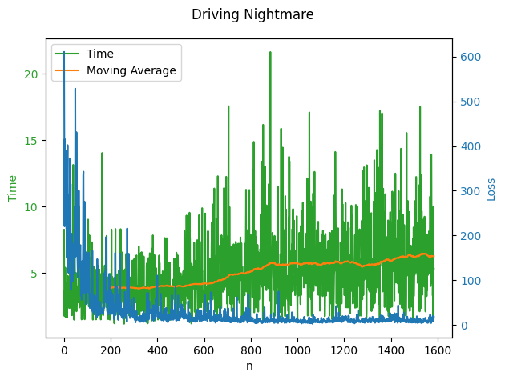
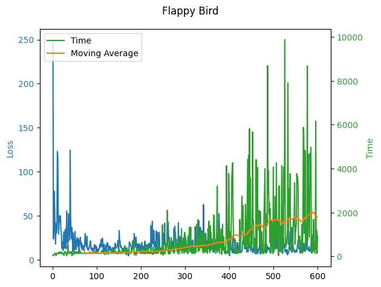

# Visual AI Player
This project aims to create a Deep Q-Learning Convolutional Neural Network (DQCNN) that generalizes well on many Video games, but can mainly control the gamejam game "[Driving Nightmare](https://misterixi.itch.io/driving-nightmare)". The idea is that the only input the AI gets, are screenshots of the game and some sort of reward signal fitting to the game. The ingame UI elements have been remove from the named game to make the learning more consistent.
Here are the two main tests from the project:  

https://github.com/user-attachments/assets/816db6db-ae10-47bb-aa69-1aa2c5d0e8bc

https://github.com/user-attachments/assets/dfcd9d2a-2da1-41eb-aa01-53354ad03fdb

## How to use:
This repository contains two different models/frameworks:  
### Python requirements
Used was Python 3.10.11 and a requirements.txt is provided. But the specific packages installed are:  
- pytorch
- tensorflow
- ipykernel
- pandas
- h5py
- matplotlib
- numpy
- pygame
- keyboard
- vgamepad
- pyautogui
- torchsummary
### Tensorflow Version:
In [Driving Nightmare AI](./driving_nightmare_AI/) is the original DQCNN built for tensorflow. This started just as a CNN, but was later changed to a Reinforcement Learning approach.  
### Pytorch Version:
In [General DQCNN](./general_dqcnn/) is a kind of branch of the original DQCNN built for pytorch. This was started to better utilize GPU ressources under windows and potentially make use of the more flexible computational graphs of pytorch.  
Currently this version is not working, since even after much training it does not improve performance, unlike the original.
### Usage:
Both versions work pretty much the same way, since the branch was created after the original DQCNN was already working in general.  
To make use of the network, a player class needs to be created that controls the game according to predictions, and also identfies and gives back the reward as feedback for learning.  
This has been realized as `DN_Player.py` and `FB_Player.py` respectively.  
They manage and run the full learning process and statistics by using `model.py`. The longer they run, the more training data is accumulated in the asscociated folder, and in theory the better the model gets.  
  
By using the `stat_plotter.ipynb` you can gain insight into the current status by plotting the statistics with the loss and performance over time.  
## Project History and performance
To learn more about the progression as well as the reasoning behind this project, you can read more in the [project documentation](./docs/project_documentation.md).  
Preview of the current performance:  
(Time means the time survived in the game, the higher the better)  
  

